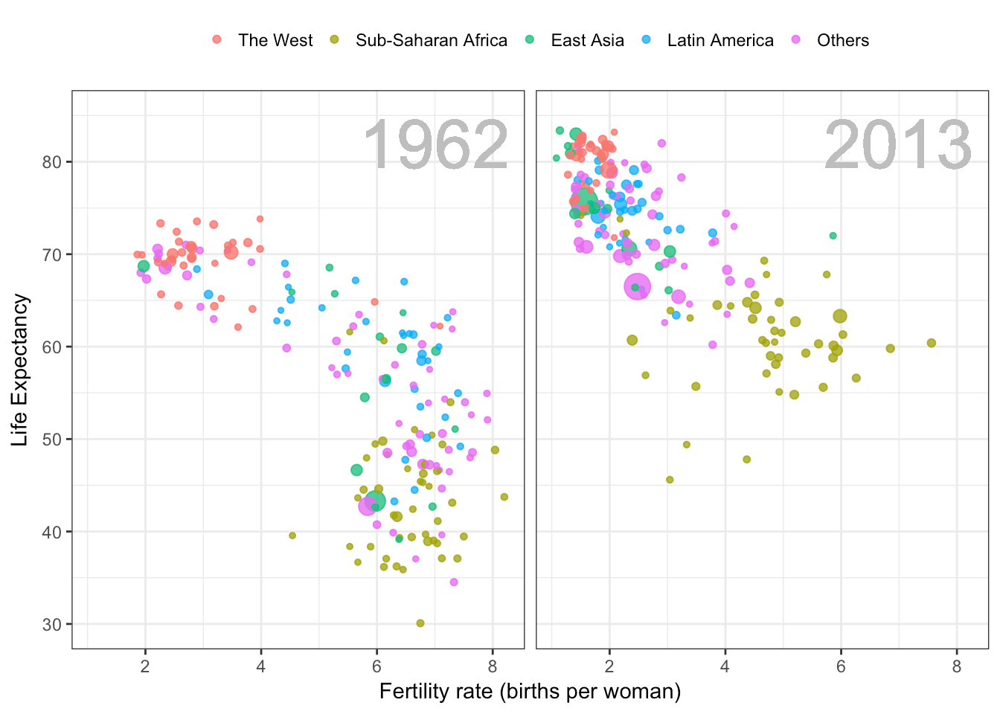

```{r setup, include=FALSE}
knitr::opts_chunk$set(echo = TRUE)
setwd("/Users/ruy/Documents/UChicago/spring2018/data_viz/")
```


```{r, message=FALSE, warning=FALSE}
# install.packages("cowplot")
# install.packages("ggpubr")
library(data.table)
library(ggplot2)
library(ggpubr)

```

# Critique

The source of the image is http://flowingdata.com/2018/04/09/datasets-for-teaching-data-science/



## Is it truthful?
One issue with the graph is that the sources are not in the graph. Then, an advaced reader can not assess by hersefl she want to belive the graph as a whole. A second issue with the graph is that it might imply causality to certain people. For instance, does fertility rate affect life expectancy? Which is the direction of the causality (if it exists)? Despite that, an educated eye will not think about causality.

Overall, the graph is truthful because it gives a meesage to the audience, and it depict the general trend of the data: life expectancy has increased and bith rate has decreased in the last years.

## Is it functional?
Yes. It shows the positive trends in the evolutions of human societies. However, I am assuming that that is the message that the author want to give. 

I believe that the size of the legeds can be bigger to increase the readability. In specific, the part where the author define the meaning of the colors can be bigger. Everything else, such as different color for different regions, big size of the text about the years, and the labeling of the aces work very well.

## Is it beautiful?
The graph is not very beautiful. However, it is not ugly. I would have preferred not using lines on the edge of the graphs. Also, the green color might not be the best combination for the other colors. For instance, certain tones of yellow might have matched better with the other color in the graph. 

Overall, I recognize that the graph is eye-catching. Yet, the colors and the style of the letters can be improved. For instace, I would have used black for the year label.

## Is it insightful?
Yes. The graph gives the idea that, in general, life expectancy has increased in the last 50 years. Also, the fertility rate has decreased in the last 50 years. 

However, the size of the circles may confuse the reader. If the author would like to be clearer, she could have used labels indicating the meaning of the size of the circles. For example, the size of the circles can be population, per capita GDP, education, or other indicators. Then, avoiding this information in the graph is a crucial mistake.

## Is it enlightening?
Yes. The graph contributes to realize about trends in the data that might not be evident just looking at the raw data. However, it depicts some data that is evident for people with training in certain fields among the social sciences. Then, it is not the most enlightening graph.


# Own graph

```{r}
# Load the data
ArtCites = fread("ArtCites.txt")
ArtCites$cites = ArtCites$cites / 1000000
ArtCites$art = ArtCites$art / 1000000
ArtCites$MeanArt = mean(ArtCites$change_cites, na.rm=TRUE)
```


```{r}
# Generate the plot
cites_graph = ggplot(ArtCites, aes(x=year))  + 
    geom_bar(aes(y=cites), stat="identity", fill="steelblue4", colour="steelblue4") +
    labs(title="Evolution of Academic Citations", y = "Citations (millions)", x = " ", colour = "Variables") +
    scale_x_continuous(breaks=c(1985, 1990, 1995, 2000, 2005, 2010, 2015)) +
    theme(plot.title = element_text(hjust = 0.5))

change_graph = ggplot(ArtCites, aes(x=year))  + 
    geom_line(aes(y=change_cites, color="indianred4")) +
    geom_line(aes(y=MeanArt, color="navyblue")) +
    labs(y = "% Change Citations", x = "Year") +
    scale_y_continuous(breaks=c(-2,0,2,4,6,8,10)) +
    scale_x_continuous(breaks=c(1985, 1990, 1995, 2000, 2005, 2010, 2015)) +
    scale_color_discrete(name = "Change", labels = c("Anual", "Mean 1985 - 2014")) +
    theme(legend.position = c(0.8, 0.25), 
          legend.title = element_text(colour="black", size=8, face="bold"), 
          legend.text = element_text(colour="black", size=7.5))
  
ggarrange(cites_graph, change_graph,
          ncol = 1, nrow = 2)

```

## Story
The number of citations has increased considerably in the last thirty years. However, the growth has not been constant. For instance, there are years where the number of citations has decreased and years where the number of citations has increased more than ten percent. Finally, on average, the number of citations has increased about 6% in the time span. Another final remark is that the number of citations per year has increased about five times since 1985.

## Why this form
I decided to use two stacked graphs. First, the bar graph depicts the increasing number of citations. Second, the line graph shows the percentual change and the mean percentual change. Then, the combination of both graphs gives the perception of 1) the total numbers of citations and its evolution, 2) the percentual change year by year. 

## Channels to encode data
I used colors that create harmony in the graph. The blues and reds are appealing to the reader. Also, those create a slight contrast between the graph one and the graph two.  I utilized a bar graph to show levels, and a line graph to show changes. According to my perception, using a bar graph and a line graph emphasizes that the first graph depicts levels and the second graph changes. 

The graphs are stacked to facilitate the comparison between the two pieces of information, the levels, and the changes.

The scale in the first graphs is millions because it helps readers to read the graphs without reading many zeros or scientific notation. 

## Transformations
I added the percentual change in the second graph to avoid to show nuances in the data. For instance, a quick view of the first graph might say that the number of citations growths steadily. Without a transformation to show percentual changes, the reader can not understand details in the data, such as years with negative growth or years with extraordinary growth.

## Facilitate communication
The colors invite the reader to pay attention to the graphs. Also, I preserve only the necessary information to facilitate the interpretation of the graph. Then, any people with basic training on statistics can make a meaningful interpretation of the content.

